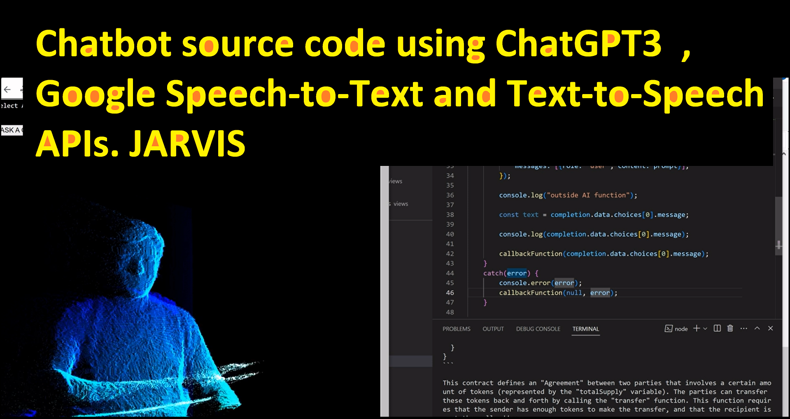

# Chatbot GPT3 (JARVIS on WEBPAGE)

  <b> This is a simple web project where I have created a chatbot who can listen your query through your microphone. Then it replies back in the audio so you dont need to read any text.</b>

Check the running demo : https://www.youtube.com/watch?v=pSoztHpyrM4 

    Following APIS are used in order to create this project 
    a - Chat GPT3.5 API
    b - Google Cloud Text to Speech API
    c - Google Cloud Speech to Text API
    d - Three.js for special effects of a 3d space bot

<h1> Register with OPEN AI </h1> 
First, you will need to sign up for an API key from the OpenAI website. 

1) You can do this by visiting https://platform.openai.com/ . 

2) Then on top right you will see your username click this and then you will find "View API Keys". 

3) Incase if you dont find keys option on your account then you have to add your billing account. As per 22-Mar-2023 open AI doesnt provide free API keys for your project. Therefore you have to register your credit card on https://platform.openai.com/account/billing/overview  

4) Now visit "View API Keys" or simply visit https://platform.openai.com/account/api-keys . 

5) Click create new API Keys. 

This API key will be used in our NodeJS project,

<h1> Register with Google Cloud</h1> 

1. Create a new Google Cloud Platform project or select an existing one in the Google Cloud Console.

2. Enable the Cloud Text-to-Speech API for your project in the Google Cloud Console.

3. Enable the Cloud Speech-to-Text API for your project in the Google Cloud Console.

4. Create a service account in the Google Cloud Console.

5. Click Add Keys select JSON file. This file contains the credentials you will use to authenticate your API requests from nodejs application to the google cloud. 

6. Download the key file and rename it as aserviceaccount.json

<h1> Pull the a NodeJS Application</h1> 

1. Pull the https://github.com/farhanx/chatgpt3Bot repo locally.

2. Install all dependent libraries as per mentioned in package.json (If you know how to code in NODE.JS you can do it easily)

Otherwise Following are the dependent librairies which must be installed

   > npm install --save  multer

   > npm install @google-cloud/speech

   > npm install openai

   > npm install dotenv 

   > npm install --save @google-cloud/text-to-speech

   > npm i ejs

   > npm i --save-dev nodemon

   > npm i express

3.  Create .env file and add following 
GOOGLE_APPLICATION_CREDENTIALS="serviceaccount.json"
OPENAI_API_KEY="[Your OPEN AI KEY]"

4. Add the serviceaccount.json file inside the project. 

5. Create two folders "upload" and "output" 

6. open the terminal and write this command

> npm run devStart   

7. Write http://localhost:40001/ on the browser

8. Make sure to give permission from your browser for the microphone and sound

9. Select approperiate audio driver and ask the query and enjoy.

   